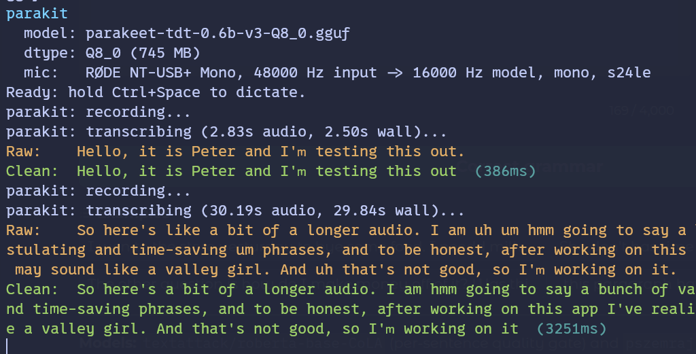

<!--
Agent notice: do not edit this README unless the user has explicitly asked for
or approved the exact README.md change you are about to make, literally and
verbatim. If that explicit approval is not present, do not touch this file.
-->

# parakit

> A [daemon](https://en.wikipedia.org/wiki/Daemon_(computing))-style[^1] local push-to-talk dictation **kit** powered by NVIDIA **Para**keet.

[^1]: Despite the daemon inspo, not everything in the design here tracks standard daemons such as `systemd`, therefore this repo is not using the `d` suffix naming convention to avoid confusion.

Hold `Ctrl+Space`, speak, release, and the transcript is inserted into the focused application.

Transcription runs locally via [NVIDIA Parakeet-TDT-0.6B-v3](https://huggingface.co/nvidia/parakeet-tdt-0.6b-v3), pre-quantized to [Q8_0 by default](https://huggingface.co/pszemraj/parakeet-tdt-0.6b-v3-gguf) through the vendored [CrispASR](https://github.com/CrispStrobe/CrispASR) runtime.



## Install

parakit is built from source. Clone with submodules first:

```bash
git clone --recurse-submodules https://github.com/pszemraj/parakit.git
cd parakit
```

### Choose Your Platform

| Platform | Quick install | Start here |
| --- | --- | --- |
| Linux X11 | `cargo install --path .` | Native packages in [docs/build.md](docs/build.md), desktop setup in [docs/linux-desktop.md](docs/linux-desktop.md). |
| Windows | `.\scripts\windows\build.ps1` then `.\scripts\windows\install.ps1` | Use the bundle scripts; they copy the required DLLs. See [scripts/windows/README.md](scripts/windows/README.md). |
| macOS Apple Silicon | `cargo install --path . --features metal` | Native arm64 + Metal install, terminal permissions, and path layout in [docs/macos-desktop.md](docs/macos-desktop.md). |

### Linux X11

Install the native packages needed for audio streaming, X11 hotkeys, and insertion as explained in [docs/build.md](docs/build.md), then:

```bash
cargo install --path .
```

Linux currently requires an X11 session for desktop hotkeys and text insertion. See [docs/linux-desktop.md](docs/linux-desktop.md).

### Windows

Use the bundle script instead of `cargo install` when you want a runnable app directory:

```powershell
.\scripts\windows\build.ps1
.\scripts\windows\install.ps1
```

CUDA and Vulkan bundles are built through the Windows scripts. See [scripts/windows/README.md](scripts/windows/README.md).

### macOS Apple Silicon

Install Xcode command line tools and Homebrew build helpers:

```bash
xcode-select --install
brew install cmake autoconf automake libtool pkg-config
```

Then install the native arm64 build:

```bash
cargo install --path . --features metal
```

This installs `parakit` to `~/.cargo/bin`. Like the Linux source-build path, it links against CrispASR/ggml shared libraries in the repository `target/` tree, so do not delete `target/` after installing. Grant Accessibility and Microphone to the terminal app that launches parakit. See [docs/macos-desktop.md](docs/macos-desktop.md).

Make sure Cargo's bin directory is on `PATH`:

```bash
export PATH="$HOME/.cargo/bin:$PATH"
```

## First Run

Run the `doctor` subcommand to preflight check, and start up the daemon:

```bash
parakit doctor && parakit
```

If `doctor` finds issues with the setup/build, it will exit 1 and print details on what's wrong. Otherwise, the following `parakit` command starts up the daemon. try it:

1. Switch to another app or text field, and put the cursor where you want text inserted.
2. Press and hold `Ctrl+Space`, say something, then release.
   - Sounds indicate start, stop, or error states.
3. Watch the dictated text appear at your cursor.

For background mode, paste options, and other runtime-related options see [docs/running.md](docs/running.md).

## Docs

- Build and native dependencies: [docs/build.md](docs/build.md)
- Windows bundle scripts: [scripts/windows/README.md](scripts/windows/README.md)
- Running, control socket, model cache, logging, and paste modes: [docs/running.md](docs/running.md)
- Linux X11 and experimental evdev-proxy setup: [docs/linux-desktop.md](docs/linux-desktop.md)
- macOS permissions, Metal, and desktop setup: [docs/macos-desktop.md](docs/macos-desktop.md)
- Cleanup rules: [docs/cleaning-rules.md](docs/cleaning-rules.md)
- Validation and quality checks: [docs/quality.md](docs/quality.md)
- Architecture and platform work: [docs/architecture.md](docs/architecture.md)
- Maintainer notes: [docs/dev.md](docs/dev.md)
- Troubleshooting: [docs/troubleshooting.md](docs/troubleshooting.md)

## License

Project code is MIT. See [LICENSE](LICENSE). Downloaded model files keep their upstream licenses; Parakeet-TDT-0.6B-v3 weights are CC-BY-4.0.
